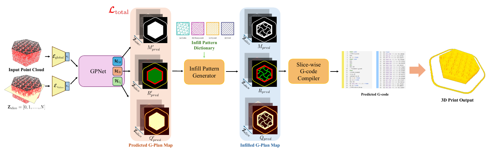
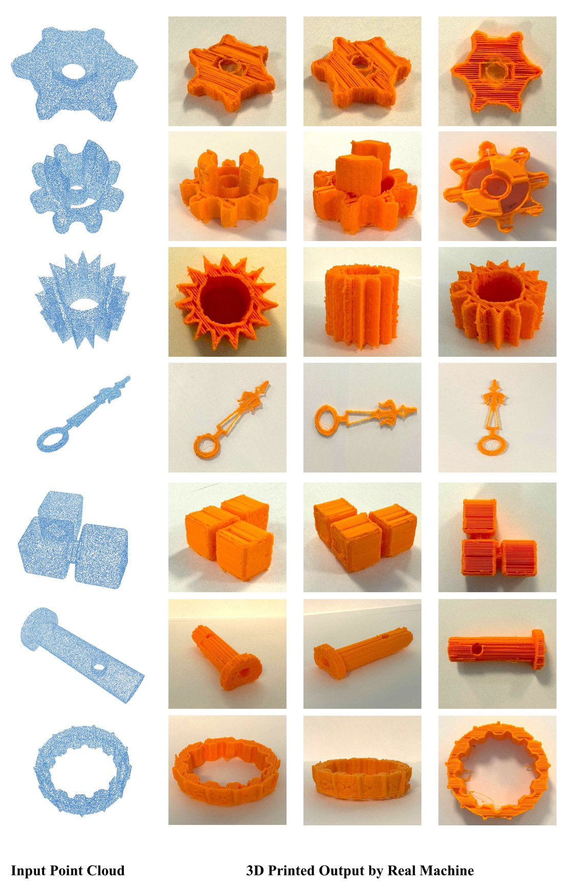
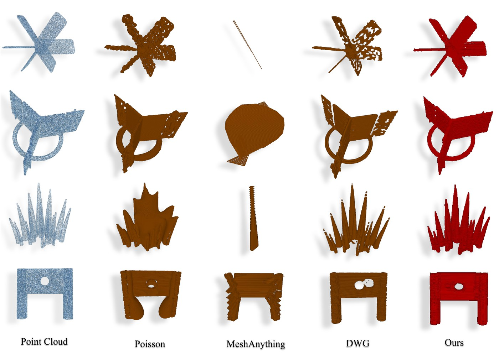

<div align="center">

# PrintAnything

### Learning Geometric Plan Map for 3D Printing G-code Generation from Unoriented Point Clouds

[Sangmin Hong](https://github.com/Sangminhong)<sup>1</sup> · Daniel Sungho Jung<sup>1</sup> · Heewon Kim<sup>3,4†</sup> · Kyoung Mu Lee<sup>1,2†</sup>

<sup>1</sup>IPAI, Seoul National University · <sup>2</sup>Dept. of ECE & ASRI, Seoul National University<br>
<sup>3</sup>Soongsil University · <sup>4</sup>Kairoba Inc. &nbsp;&nbsp;<sub>(†co-corresponding author)</sub>

**ECCV 2026**

[](https://arxiv.org/abs/2607.27729)
[](LICENSE)
[](https://www.python.org)
[](https://pytorch.org)

</div>

---

**PrintAnything turns a raw, unoriented point cloud straight into executable 3D
printing G-code — no mesh reconstruction anywhere in the pipeline.**

Existing pipelines need a watertight mesh, so a point cloud has to be
reconstructed first; the artifacts that introduces — inverted faces, holes,
topological inconsistencies — are hard to repair and propagate into the slicer.
Instead of repairing a surface, PrintAnything predicts a **Geometric plan
(G-plan) map**: a compact per-slice representation made of an occupancy map `M`
(what is printed), a region map `R` (wall, infill, support, skirt) and a flow
map `Q` (how much material to deposit).

<div align="center">

</div>

From the input point cloud and the slice indices, GPNet predicts `M`, `R` and
`Q`. The infill pattern generator fills the predicted infill regions from a
template dictionary, and the slice-wise compiler turns the result into G-code a
printer can execute.

## Real-world 3D prints

Every object below was fabricated on a Bambu Lab X1-Carbon **directly from the
G-code this pipeline generates**, with no post-processing of the toolpaths —
including cogwheels with consistent teeth and parts with thin, delicate
structures. The printed parts stayed intact under manual pressure tests.

<div align="center">

</div>

## Results

On the held-out split of [Slice-100K](https://github.com/idealab-isu/slice-100k),
against the standard workflow PrintAnything replaces — reconstruct a mesh from
the point cloud, then slice it with PrusaSlicer.

<table>
<tr><th>Representation</th><th>Method</th><th>CD ↓</th><th>F1<sub>3D</sub> ↑</th><th>F1<sub>2D</sub> ↑</th></tr>
<tr><td rowspan="3">Mesh</td><td>Poisson</td><td>0.088</td><td>0.682</td><td>0.587</td></tr>
<tr><td>DWG</td><td>0.062</td><td>0.712</td><td>0.496</td></tr>
<tr><td>MeshAnything</td><td>0.157</td><td>0.480</td><td>0.356</td></tr>
<tr><td><b>G-plan map</b></td><td><b>PrintAnything (Ours)</b></td><td><b>0.047</b></td><td><b>0.741</b></td><td><b>0.677</b></td></tr>
</table>

Mesh-based pipelines accumulate error across stages: a small reconstruction
artifact is amplified by the slicer, which shows up most clearly in the
slice-level score.

<div align="center">

</div>

Poisson smooths away thin structures and learned mesh methods break surfaces or
add local clutter, both of which turn into missing or fragmented toolpaths after
slicing. Our prints stay coherent on slender parts and sharp features.

<details>
<summary><b>Ablations</b> — multi-slice conditioning, G-plan map design, infill policy</summary>

<br>

**Multi-slice conditioning** (Table 2). Conditioning each slice on its
neighbours resolves slice-wise ambiguities: 20.3% lower CD.

| Multi-slice conditioning | CD ↓ | F1<sub>3D</sub> ↑ | F1<sub>2D</sub> ↑ |
|:---:|:---:|:---:|:---:|
| ✗ | 0.059 | 0.702 | 0.652 |
| ✓ | **0.047** | **0.741** | **0.677** |

**G-plan map design** (Table 4). The region map improves geometry; the flow map
is what makes the extrusion itself consistent — 56.8% lower Δρ-smooth.

| M | R | Q | CD ↓ | F1<sub>3D</sub> ↑ | F1<sub>2D</sub> ↑ | Δρ-smooth ↓ | ρ-CV ↓ |
|:---:|:---:|:---:|:---:|:---:|:---:|:---:|:---:|
| ✓ | ✗ | ✗ | 0.052 | 0.709 | 0.635 | 0.082 | 1.055 |
| ✓ | ✓ | ✗ | **0.046** | 0.728 | 0.675 | 0.081 | 1.059 |
| ✓ | ✓ | ✓ | 0.047 | **0.741** | **0.677** | **0.035** | **0.909** |

**Infill policy recommendation** (Table 3). The recommender reaches competitive
strength at the lowest fabrication cost, so the best strength-per-cost overall.

| Method | Strength ↑ | Cost ↓ | Combined ↑ |
|:---|:---:|:---:|:---:|
| Random pattern + random scale | 0.294 | 38,808 | 0.757 |
| Cubic + random scale | 0.298 | 36,994 | 0.806 |
| Grid + random scale | **0.310** | 41,535 | 0.748 |
| Gyroid + random scale | 0.271 | 42,247 | 0.643 |
| Honeycomb + random scale | 0.294 | 35,445 | 0.830 |
| Random pattern + fixed scale (s=1.0) | 0.300 | 35,866 | 0.837 |
| **Ours (recommender)** | 0.308 | **32,974** | **0.937** |

</details>

See [docs/REPRODUCE.md](docs/REPRODUCE.md) for the command behind each table.

---

## Install

```bash
conda create -n printanything python=3.10 && conda activate printanything
pip install -r requirements.txt
```

PyTorch should be installed for your own CUDA version first
(see [pytorch.org](https://pytorch.org)). Everything runs from a plain checkout —
no `pip install -e .` needed; the tools add the repository root to `sys.path`
themselves.

The default point encoder (`--point_encoder ptv3`) additionally needs the Point
Transformer V3 dependencies — `addict`, `timm`, `torch-scatter` and a `spconv`
build matching your CUDA version. `--point_encoder pointnet` needs nothing
beyond PyTorch.

Optional extras: `open3d` (Poisson baseline), `scikit-learn` (infill
recommender), `rtree` (infill inside-mesh validity check).

A quick check that the installation works, no dataset required:

```bash
python tests/test_pipeline.py
```

## Quick start — print your own point cloud

```bash
python tools/infer.py \
    --ckpt      checkpoints/printanything.pt \
    --input     my_scan.ply \
    --out       my_scan.gcode \
    --scale_to_mm 80 \
    --bed_center_xy_mm 110,110
```

Accepts `.ply`, `.xyz`, `.npy` and any mesh trimesh can read (it is sampled).
Normals are never used. **Always preview the result in a slicer before
printing**, and check that the printing parameters on the command line match
your machine.

## Repository layout

```
printanything/
  gplan/            the G-plan map
    constants.py        M / R / Q, the region classes, the raster size
    gcode_to_gplan.py   G-code  -> ground-truth G-plan map        (Sec. 3.1)
    slice_projection.py point cloud -> slice-aligned 2D input     (Sec. 3.2)
    gplan_to_gcode.py   G-plan map -> executable G-code           (Sec. 3.4)
    io.py               reading / writing G-plan folders
  models/
    point_encoders.py   E_global: Point Transformer V3 or PointNet-style MLP
    unet.py             U-Net blocks and FiLM, Eq. (1)
    gpnet.py            GPNet: the G-plan map predictor           (Sec. 3.2)
  infill/
    patterns.py         template dictionary + periodic warp/insert
    proxies.py          strength and cost proxies
    recommender.py      the (pattern, scale) surrogate + Pareto pick (Sec. 3.3)
  engine/
    losses.py           Eqs. (5)-(8)
    trainer.py          train / validate loops
  evaluation/
    geometry.py         CD, F1_3D, F1_2D, Eqs. (9)-(11)
    flow.py             d(rho)-smooth, rho-CV, Eqs. (12)-(13)
  datasets/             Slice-100K, the 9:1 split, scan augmentations
  inference.py          point cloud -> G-plan map -> G-code

tools/                  command line entry points (see below)
scripts/                thin shell wrappers around the usual runs
tests/                  fast end-to-end checks (no dataset, no GPU)
assets/infill_patterns/ the infill template dictionary
third_party/            Point Transformer V3 (original licence kept)
docs/                   DATA.md, REPRODUCE.md, BASELINES.md
```

## Data

PrintAnything trains on [Slice-100K](https://github.com/idealab-isu/slice-100k),
which pairs a CAD model with the G-code a standard slicer produced for it. The
ground-truth G-plan maps are rasterised from that G-code once:

```bash
python tools/prepare_gplan.py \
    --gcode_root data/slice100k/gcode \
    --out_root   data/slice100k_gplan \
    --workers 8
```

See [docs/DATA.md](docs/DATA.md) for the expected directory layout and the
on-disk format.

## Train

```bash
python tools/train.py \
    --stl_root   data/slice100k/stls \
    --gplan_root data/slice100k_gplan \
    --out_root   runs/printanything
```

Defaults follow the paper: 30k input points, 256×256 maps, AdamW at 2e-4 with
weight decay 1e-4, mixed precision, 50 epochs, one object per step. The split is
9:1 with `--seed 42`; every other tool rebuilds the identical split, so the
held-out objects are always the same.

The runs reported in the paper drew that split from the first 1000 indexed
objects — add `--max_objects 1000` here and to every evaluation command to
reproduce the tables, and see [docs/REPRODUCE.md](docs/REPRODUCE.md).

Ablations: `--z_context 0` (no multi-slice conditioning, Table 2), `--no_region`
(M only) and `--no_flow` (M + R) for Table 4.

## Evaluate

```bash
python tools/evaluate.py --ckpt runs/printanything/checkpoints/ep049.pt
```

Reports CD, F1₃D, F1₂D and slice IoU over the held-out objects. To score the
generated toolpaths as well:

```bash
python tools/generate_gcode.py --ckpt <ckpt> --out_dir outputs/val_gcode
python tools/flow_metrics.py   --gcode_root outputs/val_gcode
```

[docs/REPRODUCE.md](docs/REPRODUCE.md) maps each table of the paper to the exact
command, and [docs/BASELINES.md](docs/BASELINES.md) covers the mesh-based
baselines (Poisson, DWG, MeshAnything).

## Infill recommender

```bash
python tools/build_infill_dataset.py --ckpt <ckpt> --out_csv outputs/infill/trials.csv
python tools/train_infill_recommender.py --csv outputs/infill/trials.csv \
    --out_dir outputs/infill/recommender
```

The first command synthesises random `(pattern, scale)` policies on predicted
G-plan maps and scores them with the strength/cost proxies; the second fits the
surrogate and compares it against the fixed-policy baselines of Table 3.

## Notes on the released code

* **Point encoder.** `--point_encoder ptv3` (default) is the Point Transformer V3
  encoder described in the paper. `--point_encoder pointnet` is a light
  PointNet-style encoder that needs no custom kernels. A checkpoint remembers
  which one it used, so `load_gpnet_checkpoint` picks it up automatically.
* **Flow map range.** The flow head is an unbounded regressor, and its prediction
  is clamped to `[0, 1]` — the range of the ground-truth flow map — before
  compilation. Where the model predicts near-zero flow the compiler emits a
  toolpath that deposits little or no material; pass `--no_flow` to fall back to
  the purely geometric extrusion `line_width × layer_height × length`.
* **Printing parameters** (`--line_width`, `--walls`, `--infill_density`,
  speeds, `--bed_center_xy_mm`) are compiler settings, not model outputs. Set
  them for your own printer.

## Citation

```bibtex
@inproceedings{hong2026printanything,
  title     = {PrintAnything: Learning Geometric Plan Map for 3D Printing G-code
               Generation from Unoriented Point Clouds},
  author    = {Hong, Sangmin and Jung, Daniel Sungho and Kim, Heewon and Lee, Kyoung Mu},
  booktitle = {European Conference on Computer Vision (ECCV)},
  year      = {2026}
}
```

## Acknowledgement

This work was supported in part by the IITP grants [No. RS-2021-II211343,
Artificial Intelligence Graduate School Program (Seoul National University),
No. RS-2024-00426853, No. RS-2025-02303870, No. 2022-0-00156] funded by the
Korea government (MSIT). We thank Juhyoung Lee for assistance with the physical
3D printing and sample fabrication.

## Licence

Released under [CC BY-NC 4.0](LICENSE) (non-commercial).
`third_party/PointTransformerV3` keeps its original licence.
Figures are taken from the paper.
